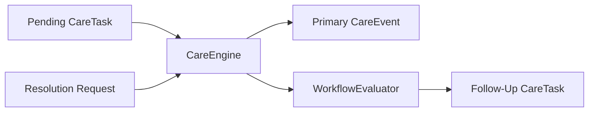
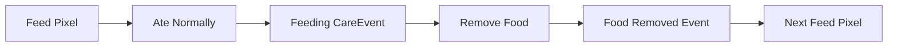

# Care Engine

The Care Engine is ReptileCare's first end-to-end execution layer.

It answers one narrow question:

> What should happen when a persisted CareTask is terminally resolved?

It does not own keeper intent, reusable care definitions, reusable workflow
definitions, UI, or notifications.

## Responsibilities

`CareEngine` orchestrates existing domain components:

- load one persisted `CareTask`
- validate the requested terminal action
- validate the selected `TaskOutcome`
- persist the terminal task replacement
- append one immutable primary `CareEvent`
- evaluate the referenced `WorkflowGraph`
- create deterministic follow-up `CareTask` records
- reconcile incomplete persisted operations after restart

`WorkflowEvaluator` is pure and side-effect free. It interprets the reusable
workflow graph and returns declarative effects. `CareEngine` applies them.

## Resolution Lifecycle

1. The request is normalized to a terminal action, aware UTC timestamp, and
   JSON-compatible payloads.
2. `CareEngine` validates that the task is still pending.
3. The task template validates `outcome_id` and structured context fields.
4. A replacement terminal `CareTask` is persisted with a deterministic
   `resolution_key`.
5. One immutable primary `CareEvent` is appended with a deterministic `event_id`.
6. `WorkflowEvaluator` returns declarative effects for the task's workflow node.
7. Follow-up tasks are created with deterministic `generation_key` values.
8. The terminal task is marked reconciled after all required work exists.

## TaskOutcome Validation

`TaskOutcome` is separate from task status.

- Status answers whether the task is `completed`, `skipped`, or `cancelled`.
- `TaskOutcome` answers what happened within that terminal action.

Current validation rules:

- `outcome_id` must be one of the task template's declared outcomes
- unknown outcome identifiers fail clearly
- structured metadata must match declared template context fields
- unknown context fields fail clearly
- required fields must be present
- optional fields may be omitted
- all data must remain JSON-compatible

There is no global outcome enum.

## Completion Context

`CareTaskResolutionRequest` is a Home Assistant-independent request model.

It currently supports:

- `action`
- `outcome_id`
- `outcome_metadata`
- `notes`
- `attachment_references`
- `actor_id`
- `source`
- `completed_at`
- `environmental_context`

The request model deliberately stores plain Python and JSON-compatible values
only. It does not depend on Home Assistant `State`, service, or entity classes.

## CareEvent Creation

Every meaningful terminal resolution creates exactly one primary immutable
`CareEvent`.

The primary event stores:

- `event_id`
- `reptile_id`
- `event_type`
- `timestamp`
- `task_id`
- `care_plan_id`
- `outcome_id`
- `context`
- `actor_id`
- `source`
- `environmental_snapshot`
- `attachment_references`

Primary event type is derived from
`TaskTemplate.completion_behavior.metadata.event_type`, not from display names.

Current built-in examples:

- `builtin:feed_fruit` → `feeding`
- `builtin:remove_food` → `food_removed`

## Workflow Evaluation

`WorkflowEvaluator` loads the reusable `WorkflowGraph` referenced by the task
and current workflow node, then returns typed effects.

Current effect vocabulary:

- `CreateTaskEffect`
- `CreateEventEffect`
- `CompleteWorkflowEffect`
- `NoOpEffect`

The evaluator:

- matches transitions by terminal action and `outcome_id`
- preserves deterministic effect ordering
- carries transition delays forward as declarative data
- never persists records
- never calls Home Assistant
- never schedules timers or sleeps

## Follow-Up Task Generation

Follow-up tasks are created only from workflow effects.

Each follow-up task:

- keeps `reptile_id`
- keeps `care_plan_id`
- keeps `workflow_id`
- sets `parent_task_id`
- preserves `workflow_chain_id`
- sets `generation_reason` to `follow_up`
- uses the effect's `workflow_node_id`
- uses a deterministic `generation_key`

The generation key is derived from stable values including:

- source `task_id`
- source `generation_key`
- workflow identifier
- effect identifier
- follow-up template identifier
- workflow node identifier
- deterministic effect position

Current execution time is not part of follow-up identity.

## Idempotency

Two layers protect idempotency:

1. `resolution_key`
   This hashes the normalized terminal request payload persisted on the task.
   Repeating the same request replays the existing result. A conflicting second
   request fails clearly.
2. Deterministic identifiers
   Primary `CareEvent` identifiers and follow-up `generation_key` values are
   deterministic, so reconciliation can safely retry after a partial failure.

## Restart Reconciliation

Home Assistant storage does not provide a multi-record transaction, so the
engine uses a small recoverable unit of work:

1. persist the terminal `CareTask` replacement with `resolution_key`
2. append the deterministic primary `CareEvent`
3. create deterministic follow-up tasks
4. mark the terminal task reconciled

On startup, ReptileCare loads persisted dependencies, then
`CareEngine.async_reconcile_pending_operations()` resumes any terminal tasks
whose `resolution_key` exists but `resolution_reconciled_at` is still unset.

This guarantees:

- no duplicate primary events
- no duplicate follow-up tasks
- repeated startup remains idempotent
- already successful writes are preserved

## Feeding Cycle Example

Current built-in behavior:

- `Feed Fruit` + `ate_normally` → feeding event + `Remove Food` due in 24 hours
- `Feed Fruit` + `ate_partially` → feeding event + `Remove Food` due in 24 hours
- `Feed Fruit` + `refused` → feeding event + workflow end
- `Feed Fruit` + `skipped` → feeding event + workflow end
- `Remove Food` completion → food_removed event + next `Feed Fruit` task

This behavior comes from `TaskTemplate` and `WorkflowGraph` data, not from
feeding-specific logic inside `CareEngine`.

## Home Assistant Boundary

Runtime data now exposes:

- `WorkflowEvaluator`
- `CareEngine`
- `CareTaskRepository`
- `CareTaskGenerator`
- `CareEventStore`
- `Timeline`

Setup order is:

1. load registries and repositories
2. load persisted CareEvents
3. reconcile incomplete CareEngine operations
4. run bounded recurring task generation
5. refresh coordinator state

Home Assistant services now call `CareEngine` through a dedicated adapter
module. They resolve external identifiers, translate Home Assistant context
into `actor_id` and `source`, and serialize stable JSON responses. Entities,
notifications, and dashboard cards remain future adapters.
