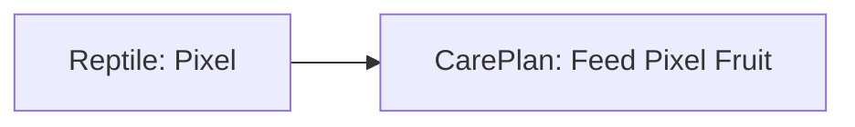
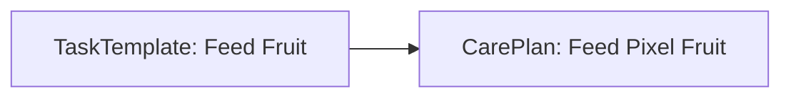
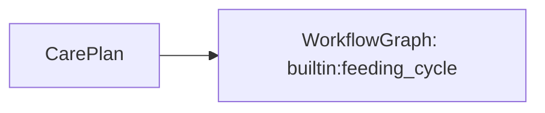
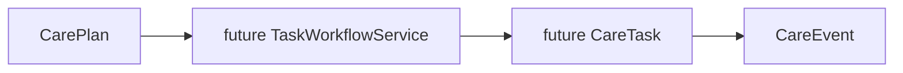

# Care Plans

Care Plans are immutable keeper-owned definitions describing what care a
specific reptile should receive.

They answer one narrow question:

> What care should this reptile receive?

Care Plans connect:

- one `Reptile`
- one `TaskTemplate`
- one `WorkflowGraph`
- one descriptive schedule

They do not create `CareTask` instances, execute workflows, record `CareEvent`
history, or schedule Home Assistant jobs in this branch.

## Purpose

Care Plans hold keeper-specific intent while keeping reusable reference models
separate:

- `Reptile` keeps the identity of one animal
- `TaskTemplate` keeps the reusable care-action vocabulary
- `WorkflowGraph` keeps the reusable behavior vocabulary
- `CarePlan` keeps the keeper's chosen configuration for one reptile

This allows a keeper to say "Pixel should follow the Feed Fruit routine every 2
days" without mutating the reptile record, the task template, or the workflow
definition itself.

## Current lifecycle

```text
Keeper-owned CarePlan
        ↓
 care_plan_to_dict
        ↓
Home Assistant CarePlan Store
        ↓
 care_plan_from_dict
        ↓
 CarePlanRepository
        ↓
 ReptileCare runtime data
```

The repository remains independent from Home Assistant entities and coordinator
execution logic. The Home Assistant storage adapter is only a persistence
boundary.

## Relationship to Reptiles

Every Care Plan belongs to one reptile by `reptile_id`.



The Care Plan does not become part of the reptile identity. Display names,
species-profile selection, and reptile-specific notes remain on the reptile
record. The Care Plan only references that reptile and adds intended care
configuration.

## Relationship to Task Templates

Task Templates remain reusable definitions of what kind of care action exists.



One task template may eventually be referenced by many Care Plans across many
reptiles. The template stays reusable; the Care Plan owns the keeper-specific
schedule and enabled state.

## Relationship to Workflow Graphs

Workflow Graphs remain reusable definitions of what behavior may follow a task
outcome.



The Care Plan references one `workflow_id` but does not execute it. Future
workflow execution belongs to `TaskWorkflowService`.

## Scheduling abstraction

The current schedule model is intentionally descriptive.

Supported now:

- every N hours
- every N days
- every N weeks
- every N months

The schedule is represented as an immutable `IntervalSchedule` value object
with:

- `schedule_type`
- `every`
- `unit`

This keeps the model compatible with future schedule types such as cron,
weekday-based plans, seasonal plans, temporary plans, or conditional plans
without redesigning the `CarePlan` boundary itself.

Care Plans do not calculate next run times in this branch.

## Reminder configuration

Care Plans also include descriptive reminder configuration:

- `enabled`
- `lead_time`
- `repeat_policy`
- `metadata`

Reminder settings are validated and serialized, but they do not create
notifications or time triggers yet.

## Model structure

The current `CarePlan` model includes:

- `care_plan_id`: stable UUID identifier
- `reptile_id`: referenced reptile UUID
- `task_template_id`: referenced reusable task template
- `workflow_id`: referenced reusable workflow graph
- `display_name`: keeper-facing label
- `enabled`: whether the plan is active
- `priority`: typed task priority intent
- `schedule`: descriptive recurring schedule
- `effective_date`: when the plan begins to apply
- `optional_end_date`: optional stop boundary
- `reminder_configuration`: descriptive reminder settings
- `metadata`: extensible structured data
- `schema_version` and `plan_version`: explicit version fields

All Care Plan models are immutable and validated at construction time.

## Repository responsibilities

`CarePlanRepository` is responsible for:

- loading persisted Care Plans
- add, update, remove, enable, and disable operations
- lookup by care plan ID
- list by reptile
- list by task template
- list by enabled state
- validating reptile, template, and workflow references

It does not schedule anything, generate tasks, execute workflows, or write
CareEvents.

## Relationship to future Care Tasks

Care Plans define intent.

Care Tasks will later represent actionable occurrences derived from that intent.



That separation keeps planning, execution, and historical facts in distinct
layers.

## Validation

Care Plan validation is intentionally strict:

- `care_plan_id` must be a UUID
- `reptile_id` must be a UUID
- `task_template_id` must be a lowercase namespaced identifier
- `workflow_id` must be a lowercase namespaced identifier
- the referenced reptile must exist
- the referenced task template must exist
- the referenced workflow graph must exist
- schedules must use supported interval units and positive values
- reminder lead times must use supported units and positive values
- enabled reminders must define a lead time
- `optional_end_date` must not be earlier than `effective_date`
- metadata must remain JSON-compatible

These rules keep Care Plans migration-ready and safe for future CareTask and
workflow execution layers to consume.
