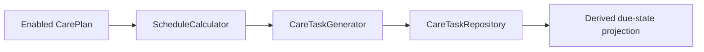

# Care Tasks

Care Tasks are concrete persisted units of work derived from keeper intent.

They answer one narrow question:

> Which actionable care items should exist right now?

Care Tasks sit between intent and history:

- `CarePlan` expresses what should happen
- `CareTask` expresses the concrete work that now exists
- `CareEvent` will later record what actually happened

This branch introduces the first CareTask foundation: persistent task records,
bounded deterministic generation, startup reconciliation, and derived due-state
projection.

It does not yet implement task completion, workflow execution, follow-up task
creation, entities, notifications, or Home Assistant services.

## Current flow

## CarePlan versus CareTask

A Care Plan is keeper-owned configuration.

Example:

- reptile: Pixel
- template: Feed Fruit
- workflow: `builtin:feeding_cycle`
- schedule: every 2 days

That plan is not the actionable task itself.

A Care Task is the persisted occurrence created from that plan.

Example:

- task: Feed Fruit for Pixel
- due at: `2026-08-05T00:00:00+00:00`
- status: `pending`

This distinction lets the keeper revise future intent without rewriting
existing operational records.

## TaskTemplate versus CareTask

`TaskTemplate` defines reusable action vocabulary.

Example:

- `builtin:feed_fruit`
- display name
- category
- completion vocabulary
- workflow compatibility

The template does not belong to Pixel and does not become due on its own.

`CareTask` is the reptile-specific persisted occurrence created from a plan
that references that template.

## Model structure

The current `CareTask` model includes:

- `task_id`: stable UUID task identity
- `reptile_id`: referenced reptile UUID
- `care_plan_id`: referenced care plan UUID
- `task_template_id`: referenced reusable task template
- `workflow_id`: referenced reusable workflow graph
- `status`: durable lifecycle state
- `created_at`: aware UTC creation timestamp
- `due_at`: aware UTC due timestamp
- `completed_at`: optional terminal timestamp
- `outcome`: reserved for future completion handling
- `notes`: optional keeper or system notes
- `attachment_references`: immutable attachment references
- `generated_by`: source descriptor for why this task exists
- `parent_task_id`: reserved for future follow-up chains
- `workflow_chain_id`: deterministic workflow-chain identifier
- `snoozed_until`: optional future visibility delay
- `assigned_user_id`: optional future user assignment
- `generation_key`: deterministic idempotency key
- `generation_reason`: typed reason the task exists
- `schema_version`: explicit serialization version

All persisted instants are timezone-aware UTC.

## Persisted status versus derived due state

Care Tasks persist only durable lifecycle facts:

- `pending`
- `completed`
- `skipped`
- `cancelled`

Due state is derived rather than stored:

- `upcoming`
- `due`
- `overdue`
- `snoozed`
- `terminal`

The current rule is:

- non-pending tasks are `terminal`
- pending tasks with future `snoozed_until` are `snoozed`
- pending tasks before `due_at` are `upcoming`
- pending tasks at or before `due_at + overdue_grace` are `due`
- pending tasks after that boundary are `overdue`

The overdue grace duration is explicit and injectable. The initial default is
zero, which means a task becomes overdue immediately after `due_at`.

## Generation reasons

Each task records why it exists.

Supported reasons:

- `recurring_care_plan`
- `manual`
- `follow_up`
- `imported`
- `system_reconciliation`

This branch currently uses:

- `recurring_care_plan` for occurrences due now or in the look-ahead window
- `system_reconciliation` for past occurrences recreated during bounded
  reconciliation

## Generation key and idempotency

Every generated task has a deterministic `generation_key`.

The current key is derived from:

- `care_plan_id`
- `plan_version`
- `task_template_id`
- `workflow_id`
- generation reason
- scheduled occurrence timestamp

The repository enforces uniqueness for both `task_id` and `generation_key`.

This makes generation:

- restart-safe
- repeatable
- safe to recompute
- resistant to duplicate task creation

Repeated generation for the same bounded window does not create duplicate tasks.

## Schedule calculation

`ScheduleCalculator` is a pure Python component that interprets the existing
CarePlan interval schedule model.

Currently supported:

- every N hours
- every N days
- every N weeks
- every N months

Behavior:

- hourly schedules use elapsed UTC duration
- daily, weekly, and monthly schedules preserve local wall-clock calendar intent
- first occurrence begins at local midnight on `effective_date`
- bounded occurrence generation respects `optional_end_date`

This keeps the schedule model compatible with future cron-like, seasonal,
weekday-based, or conditional schedules without redesigning the CareTask layer.

## Startup reconciliation

On config-entry setup, ReptileCare now:

1. loads registries and repositories
2. loads persisted CareTasks
3. runs one bounded generation pass
4. reuses existing tasks by `generation_key`
5. creates only proven-missing logical occurrences
6. exposes task services through runtime data

There is no continuous polling loop in this branch.

A future periodic scheduler or Home Assistant service can safely invoke the same
generator because the generation key makes repeated calls idempotent.

## Generation horizon

Task generation is intentionally bounded.

The initial internal defaults are:

- look ahead: 7 days
- look back: 30 days

The generator accepts explicit horizons so tests and future runtime callers can
choose narrower or broader windows without changing the domain model.

## Validation

CareTask validation is intentionally strict:

- `task_id`, `reptile_id`, and `care_plan_id` must be UUIDs
- `task_template_id`, `workflow_id`, and `generation_key` must be non-empty
- timestamps must be aware UTC datetimes
- terminal statuses require `completed_at`
- pending tasks must not have `completed_at`
- `parent_task_id` and `workflow_chain_id` must be UUIDs when present
- attachment references must remain immutable
- referenced reptiles, plans, templates, and workflows must exist
- serialized documents must match the current schema exactly

## Why completion is deferred

Task completion is intentionally outside this branch because it adds separate
concerns:

- terminal transition semantics
- outcome validation
- immutable `CareEvent` creation
- workflow-graph execution
- follow-up task creation
- restart-safe multi-record reconciliation

Those behaviors belong to a future `TaskWorkflowService`, not to this initial
generation foundation.
