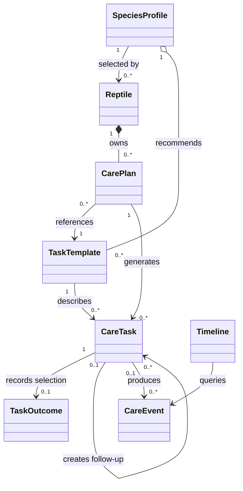
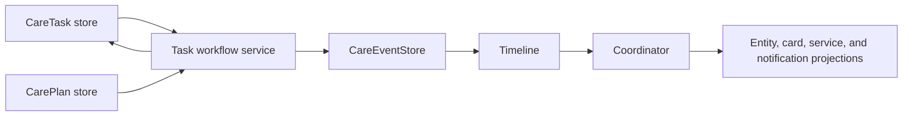
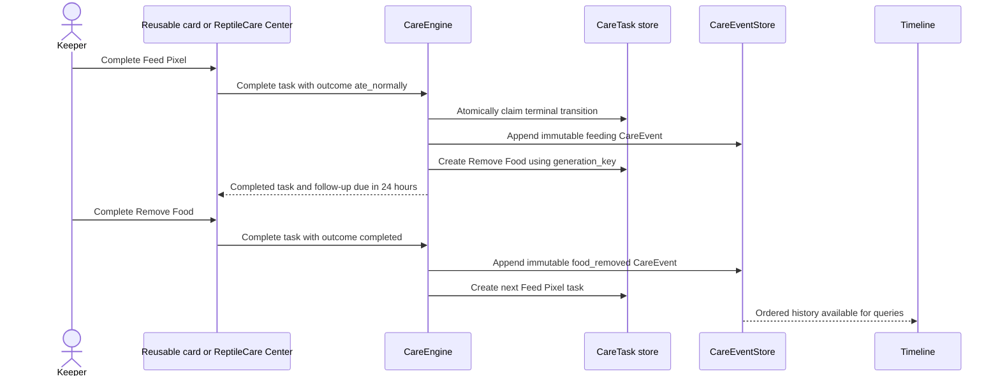

# Core Domain Design Proposal

Status: proposed architecture; no models in this document are implemented
unless identified as part of the current foundation.

## Purpose

ReptileCare is a local-first workflow engine for reptile husbandry. It should
help a keeper answer what each reptile needs next and complete routine care
with minimal effort. `CareTask` is the primary user interaction. `CareEvent`
is the immutable historical audit record, and derived views explain current
care state without duplicating history.

This proposal extends the existing event store, `CareEvent`, `Timeline`, and
coordinator boundaries. It does not replace the current foundation or prescribe
Home Assistant presentation details.

## Design principles

- Husbandry recommendations are editable defaults, not mandatory rules.
- Keeper configuration is separate from reusable species knowledge.
- Definitions, scheduled work, historical facts, and derived state have
  distinct ownership and persistence rules.
- Completing one task may create a follow-up task. Workflows are not limited to
  calendar recurrence.
- The workflow follows Option B: terminal task handling may create the next
  concrete task in the chain rather than only advancing a recurring calendar.
- All durable identifiers are stable and opaque. `reptile_id` remains the name
  of the individual-animal identifier.
- Domain behavior should be testable without a running Home Assistant instance.
- The smallest sufficient model is preferred; orchestration belongs in an
  application-layer workflow service rather than in domain records.

## Model categories

| Category | Models | Ownership |
| --- | --- | --- |
| Species-level defaults | `SpeciesProfile`, profile `TaskTemplate` definitions | ReptileCare or a future custom-profile author |
| Keeper configuration | `Reptile`, `CarePlan`, keeper-owned templates or overrides | User/config entry |
| Operational work | `CareTask`, `TaskOutcome` selection | Workflow engine and keeper |
| Immutable history | `CareEvent` | Event store |
| Derived state | Timeline results, due/overdue status, statistics, entity projections | Recomputed query/projection layers |

## Domain relationships



`TaskTemplate` is referenced by `CarePlan`; it is not owned by the plan. A
profile may recommend a template, and a keeper may instantiate a plan from it
or use a future custom template. `Timeline` is a read layer, not an owner of
events.

## SpeciesProfile

`SpeciesProfile` is versioned, reusable husbandry knowledge. It is not a
keeper's runtime state and does not determine care without keeper acceptance.

Recommended fields:

| Field | Purpose |
| --- | --- |
| `profile_id` | Stable namespaced identifier, such as `builtin:gargoyle_gecko` |
| `display_name` | Translatable common name |
| `scientific_name` | Scientific species name |
| `category` | Broad grouping for discovery, not behavior dispatch |
| `description` | Concise profile guidance |
| `default_environmental_targets` | Serialized husbandry recommendations and units; never live sensor values |
| `default_task_template_ids` | References to recommended task definitions |
| `references` | Source title, publisher, URL, and optional publication date |
| `schema_version` | Serialization schema version |
| `profile_version` | Content revision identifier |

Built-in identifiers should be stable, lowercase, and namespaced. A profile
content update retains its `profile_id` and advances `profile_version`. Schema
changes advance `schema_version` and use explicit migrations.

Future custom profiles should use a separate namespace and record authorship.
They may copy or extend a built-in profile, but a custom profile must remain
usable if the built-in profile changes or disappears.

Instantiating a reptile or CarePlan records the source profile and version plus
the user's accepted values. Profile updates may offer a reviewable update, but
must not silently overwrite user overrides or existing CarePlans. A three-way
comparison—previous default, new default, current user value—can identify
values that are safe to suggest versus values the keeper changed.

The Gargoyle Gecko profile provides Pixel's initial species label,
environmental recommendations, and task templates. Those recommendations are
defaults because husbandry varies with age, health, enclosure, climate, and
professional advice. Nothing in the model is gecko-specific.

## Reptile

`Reptile` is one animal managed by the keeper. It owns identity and descriptive
configuration, but never stores derived facts such as last feeding or next
cleaning.

Recommended fields:

- `reptile_id`: stable opaque identifier
- `display_name`
- `species_profile_id`: optional profile reference
- `species_display`: keeper-visible species value retained independently
- `morph`
- `sex`: controlled value with an unspecified/unknown option
- `hatch_date`
- `acquired_date`
- `photo_reference`
- `notes`
- `enabled`
- `enclosure_reference`: optional future enclosure identifier
- `user_overrides`: structured values that intentionally differ from defaults
- `profile_version_applied`: profile content version last reviewed

Pixel references `builtin:gargoyle_gecko`, while Pixel's morph, dates, notes,
environmental overrides, and CarePlans remain independently owned. A second
Gargoyle Gecko can reference the same profile without sharing Pixel's settings
or history.

Disabling a reptile suppresses new routine work but preserves the reptile,
plans, tasks, and CareEvents. User-facing deletion should default to archival;
destructive erasure requires a separate, explicit policy.

## CarePlan

`CarePlan` is keeper-controlled configuration for one area or workflow of care
for one reptile. It may originate from a profile recommendation, but becomes an
independent user-owned record when instantiated.

Recommended fields:

- `plan_id`
- `reptile_id`
- `task_template_id`
- `source_profile_id` and `source_profile_version`, when applicable
- `enabled`
- `trigger`: recurrence, completion-relative, event-relative, or manual
- `schedule`: trigger-specific configuration and local scheduling timezone
- `reminder_configuration`
- `user_overrides`
- `effective_at`
- `ends_at`
- `revision`

A profile default says what is commonly recommended. An instantiated CarePlan
says what the keeper intends for this reptile. A generated CareTask says what
the keeper can act on at a particular time.

Plans must not assume simple calendar recurrence. Examples include a feeding
task scheduled after the prior food-removal task, a finite medication course,
or a UVB replacement task calculated from installation. Trigger definitions
should be a small tagged union rather than an open-ended rule language in the
first implementation.

Cancelling or disabling a plan stops future generation. Existing pending tasks
require an explicit policy—normally cancel them with a recorded reason—while
completed tasks and CareEvents remain intact.

## TaskTemplate

`TaskTemplate` is a reusable definition of a care action and its workflow
behavior. It describes possible work; it is not a scheduled instance.

Recommended fields:

- `template_id`
- `display_name_key` and optional custom display name
- `description_key` and optional custom description
- `category`
- `icon`
- `outcome_definitions`
- `context_field_definitions`
- `completion_behavior`
- `follow_up_rules`
- `recurrence_behavior`
- `default_notification_behavior`
- `schema_version` and content version

Outcome and context definitions contain stable identifiers, translation keys,
types, units, and validation constraints. Follow-up rules match task status,
outcome identifier, and optional structured context, then describe a template
to instantiate and a delay. Rules should remain declarative and bounded.

Examples:

- `feed_fruit` schedules `remove_food` after a configured delay when feeding is
  completed; removing food schedules the next feeding.
- `deep_clean` can recur on a calendar while allowing a partial outcome.
- `weigh` requests a weight value and unit and may recur by interval.
- `replace_uvb_bulb` schedules the next replacement from completion time.
- `medication_dose` creates the next dose only while the finite course has
  remaining doses.
- `shed_check` may create a focused follow-up when retained shed is observed.

Built-in templates should be reusable across profiles. Future custom templates
may be keeper-owned, but should use the same validated structure.

## CareTask

`CareTask` is a concrete, persisted unit of work and ReptileCare's primary user
interaction.

Recommended fields:

- `task_id`
- `reptile_id`
- `care_plan_id`: optional for ad hoc tasks
- `task_template_id`
- `status`
- `created_at`
- `due_at`
- `completed_at`
- `outcome`: optional `TaskOutcome`
- `notes`
- `attachment_references`
- `generated_by`: plan revision, task, event, or manual source reference
- `parent_task_id`
- `workflow_chain_id`
- `snoozed_until`
- `assigned_user_id`: optional Home Assistant user reference
- `generation_key`: deterministic idempotency key

### Lifecycle

Persisted status should use `PENDING`, `COMPLETED`, `SKIPPED`, and `CANCELLED`.
`DUE` and `OVERDUE` are projections of an actionable task's `due_at`, current
time, and `snoozed_until`; storing them would create state that becomes stale
with time. A task with a future due time is pending/upcoming, one at or before
the effective current time is due, and one beyond a configurable presentation
threshold is overdue.

Only one terminal transition may win. Completing the same task twice returns
the existing result rather than producing another event or follow-up. The
workflow transaction uses `generation_key`, derived from the triggering record,
rule, and sequence position, to enforce one follow-up per logical trigger.
Storage must enforce unique `task_id` and `generation_key` values.

Snoozing changes visibility or effective reminder time; it does not rewrite
the original due time. Overdue follow-ups remain actionable and should not be
duplicated after restart.

## TaskOutcome

`TaskOutcome` is structured completion context, not a second task status.
Status answers whether work is actionable or terminal. Outcome answers what
happened when the action was resolved.

Recommended shape:

- `outcome_id`: stable machine-readable identifier scoped to a template
- `display_name_key`: translation key
- `metadata`: validated JSON-compatible values

Templates define permitted outcomes and metadata schemas. Example identifiers
include:

- Feeding: `ate_normally`, `ate_partially`, `refused`, `skipped`, `cancelled`
- Cleaning: `completed`, `partially_completed`, `nothing_to_clean`, `skipped`
- Medication: `administered`, `refused`, `missed`, `regurgitated`

An outcome can control follow-up rules. `ate_normally` may schedule food
removal; `refused` may still schedule removal but change the next feeding rule;
`cancelled` normally creates no follow-up. A `SKIPPED` status may carry a
`skipped` outcome for category-specific explanation, but the status remains the
canonical lifecycle value.

## CareEvent

`CareEvent` is the immutable audit record produced by a meaningful task action
or a manually logged observation. The current model already provides
`event_id`, `reptile_id`, `event_type`, UTC `timestamp`, and immutable metadata.
The proposed model promotes commonly queried provenance fields while retaining
structured context.

Recommended fields:

- `event_id`
- `reptile_id`
- `event_type`
- `timestamp`
- `task_id`
- `care_plan_id`
- `outcome_id`
- `context`
- `actor`: optional stable Home Assistant user identifier
- `source`: ReptileCare UI, service, automation, import, or system workflow
- `environmental_snapshot`: entity identifiers, values, units, and capture time
- `attachment_references`
- `correction_of_event_id`: optional provenance for a correction

Completing a task creates an event. Skipping creates an event when the decision
is meaningful to care history or scheduling. Cancellation should create an
event when it represents a keeper action or explains history; purely
administrative cancellation during safe cleanup may instead remain task audit
metadata. The exact cancellation policy is a product decision to lock before
implementation.

Manually logged feeding, weight, shed, health, photo, or other observations are
CareEvents without a `task_id`. Backdated imports retain their asserted event
time and record import time and source in provenance.

Home Assistant adapters may capture configured environmental entity values at
the moment an event is created. Missing or unavailable entities are recorded as
unavailable context rather than blocking care completion. Core models store
plain references and values, not Home Assistant `State` objects.

CareEvents remain immutable so audit history, derived state, and imports are
reproducible. A correction is a new CareEvent that identifies the original and
describes replacement or retraction semantics. Timeline projections interpret
the correction; the original remains available for audit.

## Timeline

`Timeline` remains the deterministic read/query layer over ordered CareEvents.
Its responsibilities are:

- stable chronological ordering;
- filtering by `reptile_id` and event type;
- inclusive or explicitly defined date-range queries;
- latest-event lookup;
- interval calculation;
- recent-activity projections; and
- reusable input for future statistics.

Timeline must not schedule tasks, evaluate CarePlans, execute follow-up rules,
or write storage. Those responsibilities belong to a task workflow service.



The coordinator owns refreshed read models and notifies Home Assistant
consumers. It should orchestrate adapters, not contain husbandry or workflow
rules.

## Runtime workflow: feeding Pixel



The event append and follow-up creation require a recoverable unit-of-work
strategy. If Home Assistant storage cannot provide a multi-record transaction,
the workflow service must be restart-safe: persist the terminal task
transition and idempotency key, then reconcile missing event or follow-up
records on startup.

## Persistence boundaries

| Object | Recommendation |
| --- | --- |
| Built-in `SpeciesProfile` and `TaskTemplate` | Package as versioned definitions; persist accepted version and overrides |
| Custom profile/template | Persist as keeper-owned versioned configuration |
| `Reptile` | Persist; archive instead of deleting by default |
| `CarePlan` | Persist revisions and active configuration |
| `CareTask` | Persist operational state so restarts do not lose due work |
| `TaskOutcome` | Persist within terminal CareTask and corresponding CareEvent |
| `CareEvent` | Persist immutably through `CareEventStore` |
| `Timeline` and due/overdue state | Derive; never authoritative storage |

UUIDs are appropriate for user-owned records. Built-in definition identifiers
should be stable namespaced strings. Serialization uses explicit JSON-compatible
schemas, schema versions, and migration functions; enum values are stable
lowercase strings.

All persisted instants are timezone-aware UTC. Schedule definitions retain an
IANA local timezone and wall-clock intent where needed. User interfaces convert
UTC to Home Assistant local time. Calendar schedules recalculate across
daylight-saving changes; duration-based follow-ups use elapsed durations and do
not shift by wall-clock DST changes.

Mutable configuration is revised or archived. Immutable events are corrected
by new events. Disabling or archiving reptiles and plans retains referenced
history. Hard deletion needs an explicit privacy/export policy and must account
for referential integrity.

## Home Assistant boundaries

- One config entry owns ReptileCare persistence, coordinator, and workflow
  services for the Home Assistant instance.
- The coordinator refreshes read models, exposes Timeline and task projections,
  and notifies listeners. It does not evaluate template rules itself.
- Home Assistant services validate inputs and delegate to domain application
  services; they never write stores directly.
- Entity projections expose stable summaries such as next task or overdue count
  without persisting duplicate domain state.
- Reusable cards consume stable service/entity contracts and enhance existing
  dashboards. The future ReptileCare Center uses the same contracts for advanced
  management, history, configuration, and statistics.
- Notification adapters observe task projections and delegate task actions back
  through the workflow service.
- User attribution stores a stable Home Assistant user identifier when
  available, without embedding Home Assistant user objects in domain models.
- Environmental references are entity IDs plus expected measurement metadata;
  adapters resolve current states and handle renamed or missing entities.

Domain dataclasses, enums, rule evaluation, and Timeline queries should run in
plain Python tests. Home Assistant tests cover adapters, config-entry ownership,
user lookup, entity resolution, and lifecycle behavior.

## Edge-case policy

| Case | Recommended behavior |
| --- | --- |
| Multiple reptiles share a profile | Share definitions only; persist separate overrides, plans, tasks, and history |
| Profile update after overrides | Preserve user values and present a three-way review of changed defaults |
| Task completed twice | Return the existing terminal result; create no duplicate event or follow-up |
| Follow-up becomes overdue | Derive overdue state from the original due time; do not regenerate it |
| Feeding skipped | Persist skipped task resolution; create an event when it affects care history; apply an outcome-specific follow-up rule |
| CarePlan cancelled | Stop generation, resolve pending tasks by explicit policy, retain completed history |
| Reptile deleted with history | Archive by default; retain `reptile_id` references and audit history |
| Daylight-saving transition | Use local wall-clock rules for calendar schedules and elapsed time for delays |
| Restart while task is due | Reload persisted tasks and derive due/overdue immediately; reconcile incomplete workflow steps |
| Backdated/imported event | Preserve asserted UTC event time and record import provenance separately |
| Historical correction | Append a correction/retraction CareEvent; never mutate the original |
| Missing HA entity | Capture unavailable context and continue unless the keeper explicitly made it required |
| Finite medication course | Track course position in plan/task context and stop follow-ups after the configured final dose |

## Recommendations

### Final model boundaries

Keep species knowledge (`SpeciesProfile`, shared `TaskTemplate`) separate from
keeper configuration (`Reptile`, `CarePlan`), operational state (`CareTask`),
completion context (`TaskOutcome`), immutable history (`CareEvent`), and read
queries (`Timeline`). Add a stateless application boundary to execute
transitions and follow-up rules against store protocols.

### Class and enum names

- Classes: `SpeciesProfile`, `Reptile`, `CarePlan`, `TaskTemplate`, `CareTask`,
  `TaskOutcome`, `CareEvent`, `Timeline`, `CareEngine`
- Enums: `CareTaskStatus`, `CareEventType`, `TaskTriggerType`,
  `CareEventSource`, and a small `Sex` enum if product language is agreed
- Rule values: `OutcomeDefinition`, `ContextFieldDefinition`, `FollowUpRule`

Do not create a global outcome enum; outcomes are template-specific stable
identifiers.

### Module layout

```text
custom_components/reptilecare/
  domain/
    species.py
    reptiles.py
    plans.py
    tasks.py
    events.py
    timeline.py
  application/
    task_workflow.py
    projections.py
  storage/
    protocols.py
    home_assistant.py
  coordinator.py
```

This layout is a target for incremental adoption, not a requirement to move
the existing event foundation before new behavior needs the separation.

### Implementation order

1. Lock identifiers, task lifecycle, outcome contract, and correction policy.
2. Add pure domain definitions and serialization tests.
3. Add profile/template loading and keeper-owned Reptile/CarePlan persistence.
4. Add persistent CareTask storage and due-state projections.
5. Implement idempotent task completion and CareEvent creation.
6. Implement bounded follow-up rules and restart reconciliation.
7. Add Home Assistant services, coordinator projections, notifications, and
   reusable cards in later roadmap milestones.

### Decisions to lock before coding

- Persisted task statuses and terminal-transition semantics
- Which skipped and cancelled actions create CareEvents
- Correction/retraction event semantics
- Idempotency and restart-reconciliation guarantees
- Initial trigger and follow-up rule vocabulary
- Profile/template identifier and versioning rules
- Local-time versus elapsed-duration scheduling behavior

### Decisions that can remain flexible

- Exact card layouts and ReptileCare Center navigation
- Future custom-profile distribution
- Optional enclosure model and household assignment
- Statistics and export presentation
- Additional TaskOutcome metadata fields and event types

### Risks and tradeoffs

- Persisting CareTasks adds operational state, but is necessary to preserve
  acknowledged work and workflow chains across restarts.
- Profile version tracking adds modest configuration complexity but prevents
  silent changes to keeper-owned care.
- Declarative follow-up rules are less flexible than arbitrary automation, but
  remain testable, migratable, and safe.
- Immutable corrections make queries more complex, but preserve auditability.
- Capturing environmental context improves history while increasing storage
  volume and exposing entity-availability edge cases.

### Open product-owner questions

1. Should a skipped task always create a CareEvent, or only when its template
   marks skipping as care-significant?
2. Should keeper cancellation of a task create a CareEvent distinct from an
   administrative cancellation caused by disabling a plan?
3. What is the initial overdue threshold: immediately after `due_at`, a
   plan-specific grace period, or presentation-specific behavior?
4. May custom TaskTemplates define follow-up rules in the first release, or
   should that initially be limited to reviewed built-in templates?
5. Should assigned users be advisory, or should assignment restrict who can
   complete a task?
6. What privacy and retention guarantees should govern hard deletion, photos,
   environmental snapshots, and exported history?
7. For profile updates, should ReptileCare offer per-field adoption, whole-plan
   adoption, or both?
