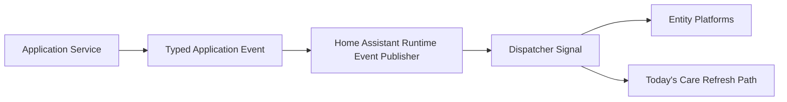

# Live Updates

ReptileCare now has a lightweight reactive update path for Home Assistant
adapters and frontend consumers.

The goal is immediate refresh after backend writes without polling, duplicate
business logic, or Home Assistant imports inside the domain layer.

## Event model

Application services now publish small immutable events for meaningful state
changes:

- `ReptileUpdated`
- `CarePlanUpdated`
- `CareTaskCreated`
- `CareTaskResolved`
- `CareEventRecorded`

These events are intentionally minimal. They carry stable identifiers and only
the data needed to trigger projection refresh.

## Architecture

The flow is:

1. a repository-backed application service commits a write
2. the application layer publishes a typed event
3. the Home Assistant adapter translates that event into dispatcher signals
4. entity platforms and frontend-facing refresh paths react

## Boundaries

- The domain layer does not import Home Assistant.
- `CareEngine` keeps ownership of task-resolution orchestration only.
- The event publisher is an adapter concern.
- Entities and frontend code react to published changes; they do not re-run
  backend business logic.

## Current publication points

- reptile create, update, enable, disable
- care plan create, update, enable, disable
- persisted task generation
- task resolution through `CareEngine`
- manual event logging

Preview-only operations do not publish events because they do not modify
repositories.

## Coordinator behavior

`CareEventRecorded` triggers a timeline refresh from the immutable event store.
Other event types still dispatch runtime signals so entities can refresh task
and reptile projections immediately.

This keeps the event store authoritative for timeline state while avoiding
manual refresh calls scattered across service handlers.

## Entity and frontend behavior

Entity platforms subscribe to runtime event signals for:

- state refresh
- device-name refresh when `display_name` changes
- dynamic reptile entity discovery

The bundled **Today's Care** card continues to refresh from existing entity
state changes, so it benefits from the reactive backend path without adding a
separate polling loop or custom browser event channel.

## Stability rules

- Event names should be treated as adapter contracts.
- Payloads should stay small and identifier-focused.
- New event types may be added later, but existing payload meanings should not
  change casually.
- Home Assistant-specific objects must not appear in application event payloads.
