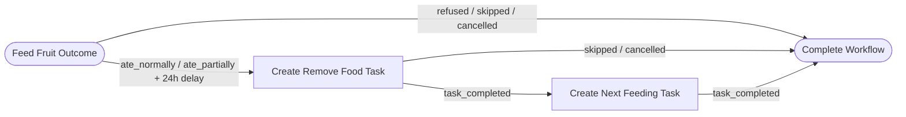

# Workflow Graphs

Workflow Graphs are immutable reusable definitions describing what should
happen after a task reaches a particular outcome.

They answer one narrow question:

> What behavior should follow this task outcome?

They do not execute anything themselves.

## Purpose

Workflow Graphs prepare ReptileCare for future:

- workflow execution
- follow-up task generation
- dashboard navigation
- automation targeting
- service APIs

This branch defines the workflow language and now ships the first pure
`WorkflowEvaluator` plus `CareEngine` execution loop. Graphs still remain
descriptive definitions; they do not persist or schedule anything by
themselves.

## Current lifecycle

```text
Bundled JSON workflow
        ↓
 workflow_graph_from_dict
        ↓
   WorkflowGraph
        ↓
 WorkflowRegistry
        ↓
 ReptileCare runtime data
```

The registry is pure domain logic and remains independent from Home Assistant
entities, scheduling, and coordinator behavior.

## Model structure

The current `WorkflowGraph` model includes:

- `workflow_id`: stable namespaced identifier such as `builtin:feeding_cycle`
- `display_name`: keeper-facing label
- `description`: reusable description of the graph's intent
- `version`: graph definition version
- `start_node`: required entry node identifier
- `nodes`: immutable `WorkflowNode` definitions
- `transitions`: immutable `WorkflowTransition` definitions
- `metadata`: extensible structured data
- `schema_version`: explicit serialization version

Associated domain types:

- `WorkflowNode`: typed node definition
- `WorkflowTransition`: structural edge between nodes
- `WorkflowTrigger`: descriptive trigger for a transition
- `WorkflowCondition`: placeholder condition definition
- `WorkflowDelay`: structural delay definition
- `WorkflowActionDefinition`: descriptive action attached to action nodes

## Node types

Supported node types are intentionally small:

- `start`
- `action`
- `decision`
- `end`

The graph model is designed so future branches can add richer branching,
retries, finite repetitions, and user-authored workflows without changing the
core identity rules.

## Transition structure

Transitions connect nodes and describe how the graph may move later.

Current placeholder trigger types:

- `task_completed`
- `outcome_selected`
- `timeout_elapsed`
- `manual_trigger`

Delays are structural data only, for example `24 hours` or `7 days`. They do
not schedule timers in this branch.

## Built-in example

This branch includes one bundled built-in graph:

- `builtin:feeding_cycle`

It models the current built-in feeding cycle:



Primary CareEvents are now created by `CareEngine` from task-template metadata.
The workflow graph is responsible for declarative follow-up behavior, not for
inferring event types from display names.

## Relationship to Task Templates

Task Templates define what kind of care action exists.

Workflow Graphs define what behavior may follow a particular task outcome.

```text
TaskTemplate --> WorkflowGraph --> future TaskWorkflowService
```

Templates may reference a graph through `completion_behavior.workflow_graph_id`
without embedding the workflow definition inline. That keeps reusable action
vocabulary separate from reusable behavior vocabulary.

## Validation

Workflow validation is intentionally strict and explicit:

- workflow IDs must be lowercase namespaced identifiers
- node IDs must be unique lowercase identifiers
- the start node must exist and be a `start` node
- transitions must reference known nodes
- start nodes may not have incoming transitions
- graphs must contain at least one `end` node
- end nodes may not have outgoing transitions
- non-end nodes must have at least one outgoing transition
- orphan nodes are rejected
- schema versions must match the supported serializer version

This keeps bundled graphs deterministic, migration-ready, and safe for future
execution layers to consume.

## Registry responsibilities

`WorkflowRegistry` is responsible for:

- loading bundled JSON workflow graphs
- strict validation during load
- duplicate ID detection
- deterministic ordering
- explicit lookup behavior

It does not persist data, call Home Assistant, or schedule follow-up work on
its own. `WorkflowEvaluator` consumes these validated graphs and returns typed
effects for `CareEngine` to apply.
